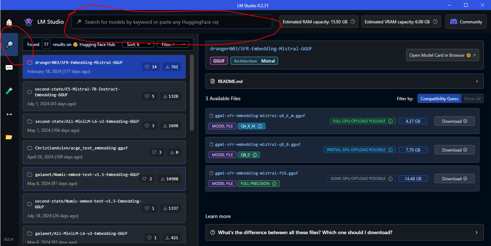
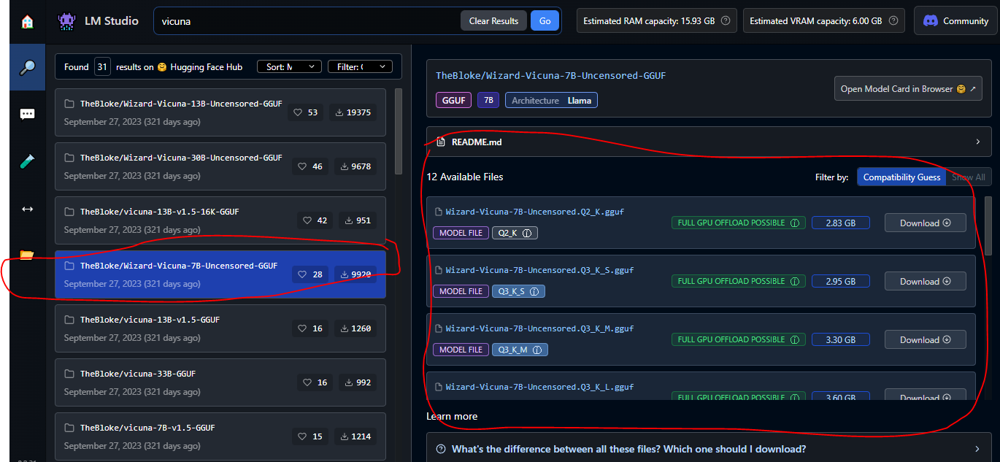
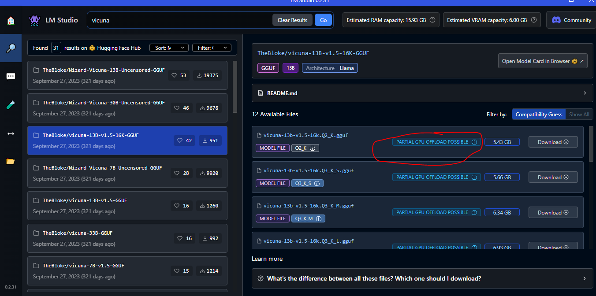
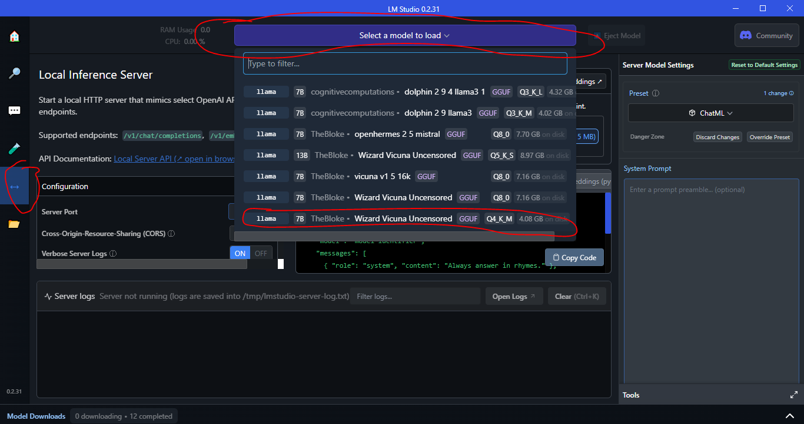
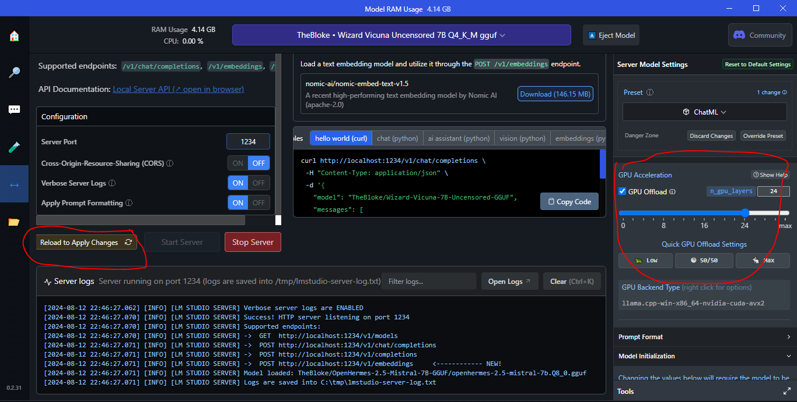

   

<h3 align="center">MyWaifu</h3>

---

 Make your waifu real
      

## 💖 Help MyWaifu keep alive and improve

**MyWaifu** is a free open source project and it'll always be for anyone use the way they think it's the best. 

**You can help MyWaifu continuity with codes and/or donating at Ko-fi**

   

* [Objectives](#objectives)
* [Talk to your waifu](#problem_statement)
* [🚨 Instalation guide](#instalation_guide)
* [🧾Usage guide & recommendation](#usage_guide)
* [✍️ Authors](#authors)

## 🖊 Objectives 

### 🥇 Main Objectives

- [ ] Create chat system with user and AI playing the role of a waifu
- - [x] Support to LMStudio (primary)
- - [ ] Support to GPT api's
- [ ] Create VOICE chat system between user and waifu
- - [ ] User speech recognition (Speech to text)
- - [ ] Waifu TTS (Text To Voice)
- [ ] Waifu emotion detection for each speech
- [ ] Work on Live2D of the waifu (e.g expressions, motions, rigging)

### 🥈 Secundary obectives (nice 2 have)
- [ ] Long term memory (Waifu should remember events and previous messages)
- [ ] A platform or script to make easier for "modding" (e.g someone add their custom waifu, Live2d, voice, etc)

## Talk to your waifu 
Have your own waifu on your PC without limits, no queues, and forever. Over time, features and improvements will be added with the support of the community.

## 🚨 Instalation guide 
Here follows an intalation guide step by step, in future releases some steps may become automatic, making it even more easier for fresh install:

### 1 - Install Node.js

Node.js will be the "fuel" of this project. No, you don't need to know what it is or what it does just have it installed.

In case you already have it make sure it's above version 18

Download it here: https://nodejs.org/en

### 2 - Install LM Studio

LM Studio will contain the core of your waifu, it's imperative for it to be installed.

Don't worry it has a very user friendly usage.

Download it here: https://lmstudio.ai/

### 3 - Install MyWaifu

Now install MyWaifu. 

You can download the zip or tar.gz right here on GitHub - https://github.com/2D-girls-enjoyer/MyWaifu/releases

Also, here is a guide on how to download from GitHub: https://blog.hubspot.com/website/download-from-github#repository

### Done!!!
Now that you have everything installed let's move to the usage guide, so you can begin using MyWaifu!

##  🧾Usage guide & recommendation 

### 1 - Set up LM Studio
Firstly, you need to choose what AI it will be based on. This is a very important step since it will determine the quality and speed of the waifu responses. 

(If you already have a somewhat knoledge in LLM models feel free to choose one and try)

#### 1.1 - Search and download the model (If your first time)
Go to "Search" to find your model

   

   

⚠️Warning: Prefer models that can be fully or partially loaded on GPU⚠️

   

##### Recommendation for model
These AI models comes with quality vs speed trade off, which means: An AI model with the best quality will be slower and require more of your PC and an poor quality AI will be faster and require less (⚠️Not a rule, so there will be cases where the AI model is slow and has poor quality in this case ⚠️) so you need to find the perfect balance for your case

I've tested several AI's and the best models so far were these:

1. (Very Stable - Recommended) **TheBloke/Wizard-Vicuna-7B-Uncensored** (Q4_K_M) - Note: So far this is the best model give good responses and doesn't require much of you PC. In case it's too large for your PC try the same but with tag on it Q3_K_S

2. (Instable) **TheBloke/OpenHermes-2.5-Mistral-7B-GGUF** (Q8_0) - Note: This one requires more of your PC and is not so stable compared to **Wizard-Vicuna-7B-Uncensored**, but it offers better responses

3. (Almost stable) **cognitivecomputations\dolphin-2.9.4-llama3.1-8b-gguf** - Note: This has a great response and very straighfoward and active, so if you want a more intensive conversation with your waifu this is the model

#### 1.2 - Use the model
Go to "Local Server" and click "Select a model to load" to choose a model

   

⚠️Warning: In case you get a message like this⚠️

   

   

It basically means your AI model is too big for your GPU memory but you can "fix" it:

Simply on the right side, scroll and find on GPU settings a slider "GPU Acceleration" and lower it and launch again until it fits on your GPU

   

### 2 - Start MyWaifu
To start MyWaifu is very simple 

⚠️Warning: The first time you start it might take some time, since it will build and run⚠️

#### On Windows
Double-click the **MyWaifu-Windows.bat** and it's up and running

#### On Linux
Double-click the **MyWaifu-Linux.sh** and it's up and running

## ✍️ Authors 

- [@weeb_head_yabai](https://twitter.com/weeb_head_yabai) - Idea & Initial work 

## 🎉 Acknowledgments 

Later
