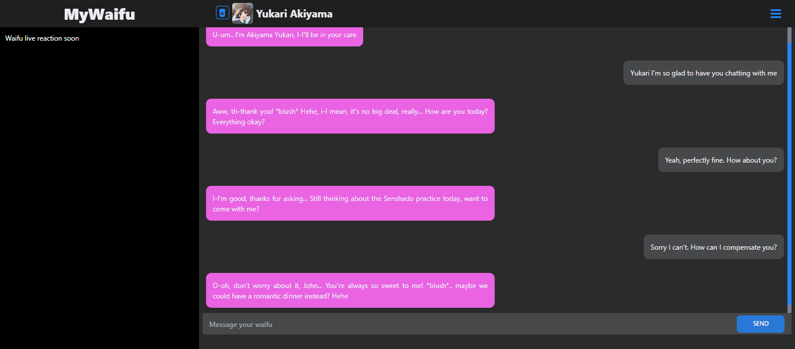
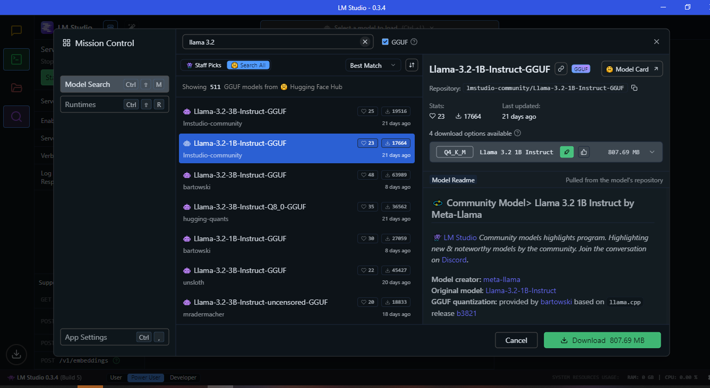

   

<h3 align="center">MyWaifu</h3>

---

 The helpful waifu you want at your PC
      

## 💖 Help MyWaifu keep alive and improve

**MyWaifu** is a free open source project and it'll always be.

**You can help MyWaifu continuity with codes and/or donating at Ko-fi**

   

* [Your talkative and helpful waifu](#problem_statement)
* [🚨 Instalation guide](#instalation_guide)
* [🧾Usage guide & recommendation](#usage_guide)
* [✍️ Authors](#authors)

## Your talkative and helpful waifu 
Imagine having your favorite waifus as your assitant and spending time talking at your own PC, all for free and forever.

Sugoi, right?

For now only chatting is available but, in future releases, your waifu will also be able to assist you with general tasks on your computer and answer your questions, just like your personal assistant.

   
  

   
  

## 🚨 Instalation guide 
Here follows an intalation guide step by step, in future releases some steps may become automatic, making it even more easier for fresh install:

### 1 - Install Node.js

Node.js will be the "fuel" of this project. No, you don't need to know what it is or what it does just have it installed.

In case you already have it make sure it's above version 18

Download it here: https://nodejs.org/en

### 2 - Install LM Studio

LM Studio will contain the core of your waifu, it's imperative for it to be installed.

Don't worry it has a very user friendly usage.

Download it here: https://lmstudio.ai/

### 3 - Install MyWaifu

Now install MyWaifu. 

You can download the zip or tar.gz right here on GitHub - https://github.com/2D-girls-enjoyer/MyWaifu/releases

### Done!!!
Now that you have everything installed let's move to the usage guide, so you can begin using MyWaifu!

##  🧾Usage guide & recommendation 

### 1 - Set up LM Studio
First, you need to choose what AI it will be based on. This is a very important step since it will determine the quality and speed of the waifu responses.

⚠️Warning: Double check if you are at Power User mode before all⚠️

   

(If you already have knoledge in LLM models feel free to choose any and try)

#### 1.1 - Search and download the model (If your first time)
Go to "Discover" to find new models and download it. 

   

Some models has multiple options to download.

To simplify things, think that the less space (Gigabytes) it has, the more "dumb" the model will be, but it'll be faster.

⚠️Warning: Prefer models that can be fully or partially loaded on GPU⚠️

   

##### Recommended models

1. (Character fidelity | General activities) **Llama-3.2-3B-Instruct-GGUF** (Q4_K_M) by **lmstudio-community** - Note: In terms of character personification, it has a good fidelity to it's personality (so if your waifu is unresonable, so it'll be) and has decent grasp on general knowledge.

2. (Character "realism") **stablelm-zephyr-3b-GGUF** (Q4_K_M) by **TheBloke** - Note: It can assimilate the waifu personality but it'll ground it to reasonable responses. In other words, it'll be as if your waifu lived in the real world and had boundries.

#### 1.2 - Use the model
Go to "Developer" and click "Select a model to load" choose your model.

Also make sure to click "Start Server", so MyWaifu can communicate with the AI.

   

**TIP:** After loading the model you can balance the usage of GPU (in case your GPU is "weak"). Note this will be a trade off between your RAM and CPU, so "less GPU" more CPU and RAM it will consume. 

### 2 - Start MyWaifu
To start MyWaifu is very simple 

⚠️Warning: The first time you start it might take some time, since it will build and run⚠️

#### On Windows
Double-click the **MyWaifu-Windows.bat** and it's up and running

#### On Linux
Double-click the **MyWaifu-Linux.sh** and it's up and running

## ✍️ Authors 

- [@weeb_head_yabai](https://twitter.com/weeb_head_yabai) - Idea & Initial work 
